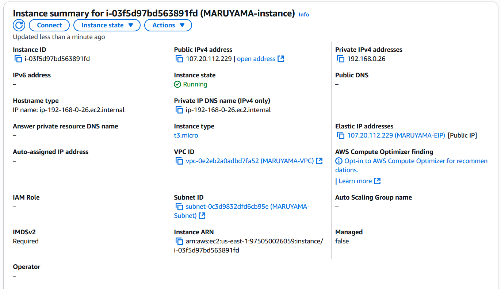

# Part 1 - Build a VPC
1. Create a VPC
    * A VPC is a virtual framework that mimics the function of a private network for AWS instances.
    * 
2. Create a Subnet
    * A subnet is a virtual division in a private network, to which separate rules can be applied.
    * 
    * Reserved block: 192.168.0.0/24. Remaining: 192.168.1.0/24
3. Create an Internet Gateway
    * An internet gateway is a connection from a private network to the broader internet.
    * 
4. Create a Route Table
    * A route table is a set of rules specifying where different types of traffic should be routed.
    * 
5. Create a Security Group
    * A security group is a stateless virtual firewall associated with an AWS resource, dictating what kinds of traffic can come and go from where.
    * 
6. Create a Network ACL
    * A NACL is a stateful virtual firewall which is always associated with at least one subnet.
    * 
7. Create a Key Pair
    * A Key Pair is used for public key/private key encryption, in this case to enable secure ssh connection to our AWS instances.
    * The private key is kept on the client machine, while the public key is stored on the server.
    * 
8. Create an Elastic IP Address
    * An elastic IP address is an IP address which is reserved for your AWS account until you release it, and thus can be relied on not to change unless you want it to.
    * 

# Part 2 - EC2 Instance Creation

1. Create a new Instance.
    * An Instance is a virtual server/comuputer on Amazon's cloud infrastructure, which comes with a certain allocation of hardware resources and an operating system.
    * To create an instance, go to the EC2 console and click Launch Instance, then configure it to suit your needs.
    * Amazon Linux 2023 AMI 2023.9.20250929.0 x86_64 HVM kernel-6.1
    * Default Username: ec2-user
    * Instance type: t3.micro
    * keypair: vockey
    * A key pair must be selected so that you can actually connect to the instance via ssh.
    * Naming the instance should be self-explanatory given there's a text box for "Name"
    * To specify the VPC, Subnet, and Security group, click Edit on the Network settings and choose your selections from the respective drop-downs.
    * To add a volume, simply click the 'Add new volume' button under 'Configure storage,' then select the size and hardware type you want.
    * To associate the Elastic IP with the instance, head to the Elastic IPs tab in the EC2 console under Networ & Security, then check the box for the EIP and click Actions, and then Associate Elastic IP Address. Then simply choose the correct instance and a private IP address and hit associate.
    * 

# Part 3 - Instance Configuration
1. SSH into the instance
    * You could do this by manually specifying details in the ssh command, but I chose to add the instance to .ssh/config, putting in the Elastic IP as hostname, ec2-user as User, and the private key as the Identity File. Then, all I had to do was type `ssh aws-3120` and it would connect.
    * To change the hostname, `sudo hostname MARUYAMA-PROJ1` was all it took.
    * 