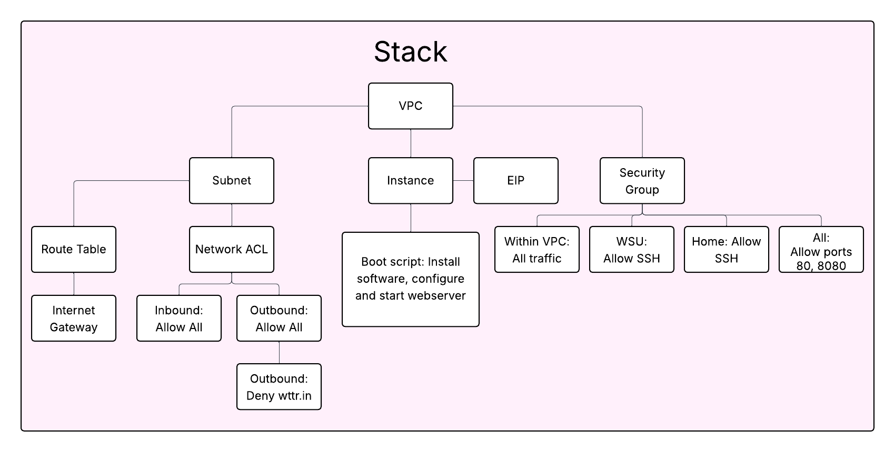

This CF creates a stack which will stand up a website on ports 8080 and 80 as configured via files from the project github and the wsukduncan/cheatsheet docker image, as well as installing useful or necessary tools such as git, docker, httd, and python3. The server is also accessible via ssh from WSU or my home IP.

